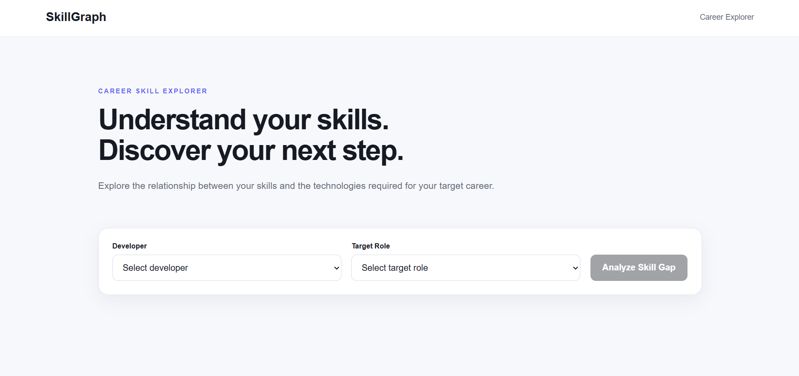
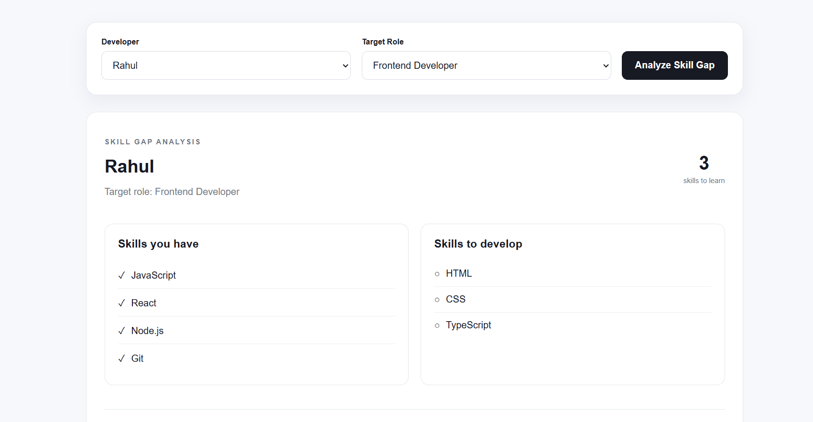
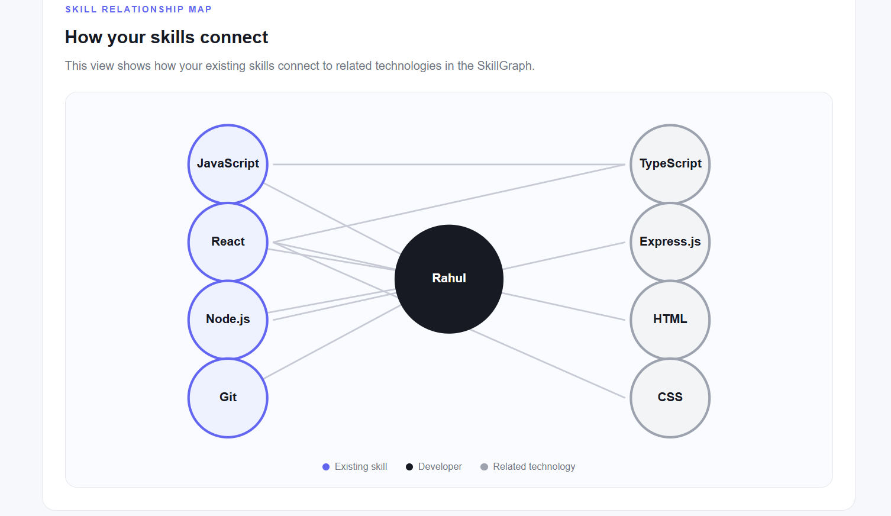

# SkillGraph

SkillGraph is a graph-powered career skill explorer built using React, Node.js, Express, and CognoDB.

It helps developers understand:

- The skills they currently have
- The skills required for a target job role
- The skill gap between their current profile and the target role
- Related technologies connected to their existing skills

## Problem Statement

Developers often know several technologies but may not know which skills they need to develop for a particular career role.

SkillGraph models developers, skills, job roles, projects, and their relationships as a graph so that career-related connections can be explored naturally.

## Why a Graph Database?

The core questions in SkillGraph are relationship-focused.

For example:

> Which technologies are related to the skills that a developer already knows?

This can be represented as:

```text
Developer → HAS_SKILL → Skill → RELATED_TO → Related Skill
```

This two-hop traversal is a natural graph query because the value comes from following relationships between entities.

A relational database could represent the same information using multiple tables and joins, but graph traversal makes these connected queries more direct and expressive.

## Technology Stack

### Frontend

- React
- Vite
- CSS

### Backend

- Node.js
- Express.js
- Neo4j JavaScript Driver

### Database

- CognoDB
- Cypher

## Architecture

```text
React Frontend
      |
      | HTTP requests
      v
Express Backend
      |
      | Parameterized Cypher
      v
CognoDB Graph Database
```

The React frontend provides the user interface.

The Express backend exposes API endpoints and executes parameterized Cypher queries through the Neo4j JavaScript driver.

CognoDB stores the application data as a graph.

## Screenshots

### Home



### Skill Gap Analysis



### Skill Relationship Map



## Data Model

The main node types are:

- Developer
- Skill
- JobRole
- Project

The graph uses typed relationships such as:

- HAS_SKILL
- REQUIRED_FOR
- RELATED_TO
- USES
- BUILT

A simplified model is:

```text
Developer
   |
   | HAS_SKILL
   v
 Skill
   |
   | RELATED_TO
   v
Related Skill


JobRole
   ^
   |
REQUIRED_FOR
   |
 Skill
```

## Skill Gap Analysis

The application compares the skills owned by a developer with the skills required for a target role.

For example:

```text
Developer skills:
JavaScript
React
Node.js
Git

Frontend Developer requirements:
JavaScript
React
HTML
CSS
TypeScript

Missing skills:
HTML
CSS
TypeScript
```

The backend retrieves the developer's existing skills and the skills required by the selected role. The missing skills are then calculated by comparing the two sets.

## Graph Exploration

SkillGraph also performs a two-hop graph traversal:

```text
Developer
    |
    | HAS_SKILL
    v
  Skill
    |
    | RELATED_TO
    v
Related Skill
```

This allows the application to find technologies connected to the developer's existing skills.

For example:

```text
Rahul
  |
  | HAS_SKILL
  v
React
  |
  | RELATED_TO
  +----> HTML
  +----> CSS
  +----> TypeScript
```

This gives the user additional technologies to explore based on their current skill set.

## Example Cypher Query

The following query performs the two-hop skill exploration:

```cypher
MATCH (d:Developer {name: $developer})
      -[:HAS_SKILL]->
      (skill:Skill)
      -[:RELATED_TO]->
      (related:Skill)
RETURN
  d.name AS developer,
  skill.name AS currentSkill,
  collect(DISTINCT related.name) AS relatedSkills
ORDER BY currentSkill
```

The `$developer` value is supplied separately as a Cypher parameter rather than being concatenated directly into the query.

## Skill Gap Query

The application retrieves the developer's skills and the skills required by the target role:

```cypher
MATCH (d:Developer {name: $developer})
MATCH (r:JobRole {name: $role})

OPTIONAL MATCH (d)-[:HAS_SKILL]->(owned:Skill)

OPTIONAL MATCH (required:Skill)-[:REQUIRED_FOR]->(r)

WITH
  d,
  r,
  collect(DISTINCT owned.name) AS ownedSkills,
  collect(DISTINCT required.name) AS requiredSkills

RETURN
  d.name AS developer,
  r.name AS role,
  ownedSkills,
  requiredSkills
```

The backend then determines which required skills are not present in the developer's existing skill set.

## Parameterized Queries

User-provided values are passed as Cypher parameters:

```js
{
  developer,
  role
}
```

rather than being inserted directly into the Cypher query.

This keeps the query structure separate from user input.

## API Endpoints

The backend exposes endpoints for retrieving developers, job roles, skills, skill-gap analysis, and graph exploration.

Examples include:

```text
GET /api/developers
GET /api/roles
GET /api/skills
GET /api/skill-gap?developer=Rahul&role=Frontend%20Developer
GET /api/explore/Rahul
GET /api/roles/Frontend%20Developer/skills
```

## Seed Data

The project includes a seed script that creates the initial graph data for developers, skills, job roles, projects, and relationships.

The seed script is located at:

```text
backend/scripts/seed.js
```

## Project Structure

```text
SkillGraph/
│
├── backend/
│   ├── scripts/
│   │   └── seed.js
│   │
│   ├── src/
│   │   ├── routes/
│   │   │   ├── developerRoutes.js
│   │   │   ├── exploreRoutes.js
│   │   │   ├── roleRoutes.js
│   │   │   ├── skillGapRoutes.js
│   │   │   └── skillRoutes.js
│   │   │
│   │   └── db.js
│   │
│   ├── .env
│   ├── package.json
│   └── server.js
│
├── frontend/
│   ├── src/
│   ├── package.json
│   └── ...
│
├── screenshots/
│   ├── home.png
│   ├── skill-gap.png
│   └── graph.png
│
├── .gitignore
└── README.md
```

## Environment Variables

Create a `.env` file inside the `backend` directory:

```env
COGNODB_URI=your_cognodb_uri
COGNODB_USERNAME=your_cognodb_username
COGNODB_PASSWORD=your_cognodb_password
```

Do not commit the `.env` file or database credentials to source control.

## Running Locally

### 1. Start the Backend

Open a terminal:

```bash
cd backend
npm install
node server.js
```

The backend runs on:

```text
http://localhost:5000
```

### 2. Start the Frontend

Open another terminal:

```bash
cd frontend
npm install
npm run dev
```

The frontend runs on the Vite development server.

Open the URL shown by Vite, usually:

```text
http://localhost:5173
```

## Application Workflow

The main workflow is:

```text
Select Developer
       |
       v
Select Target Role
       |
       v
Analyze Skill Gap
       |
       +----------------------+
       |                      |
       v                      v
Skills You Have        Skills To Develop
       |
       v
Explore Related Skills
       |
       v
Skill Relationship Map
```

## Error Handling

The application handles:

- Missing developer or role parameters
- Developers or job roles that do not exist
- Database/query failures
- Frontend API failures
- Loading states
- Empty initial state

The backend also closes database sessions in `finally` blocks after database operations.

## Engineering Tradeoffs

### Graph Database

CognoDB was chosen because the application's main functionality depends on relationships between developers, skills, job roles, and related technologies.

### Skill-Gap Calculation

The graph query retrieves the developer's owned skills and the target role's required skills.

The final missing-skill calculation is performed in JavaScript because it is a simple set comparison:

```text
Missing Skills = Required Skills - Owned Skills
```

### Graph Exploration

The related-skill feature uses a two-hop traversal:

```text
Developer → Skill → Related Skill
```

This demonstrates a relationship-focused use case for a graph database.

### Frontend Filtering

Related technologies that are already owned by the developer are filtered before being displayed as recommendations. This avoids showing duplicate or irrelevant recommendations.

### Simple User Interface

The application focuses on one clear workflow:

```text
Developer → Target Role → Analyze Skill Gap → Explore Related Skills
```

This keeps the experience simple and understandable.

## Future Improvements

Possible future improvements include:

- Personalized learning paths
- Skill proficiency levels
- More detailed career recommendations
- Project-based skill recommendations
- Authentication and user profiles
- Interactive graph filtering
- Skill progression tracking
- More job roles and technology relationships

## Author

Pranav Chandam